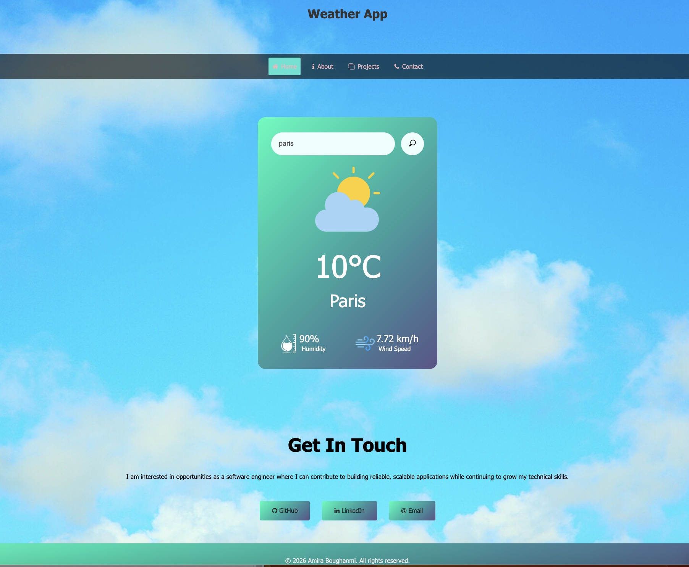

# 🌦️ Weather App

## 📌 Overview

This Weather App is a front-end project built using **HTML, CSS, and JavaScript**.  
It fetches real-time weather data from an external API and dynamically updates the UI based on the returned data.

The goal of this project was to practice:

- Working with APIs
- Handling asynchronous JavaScript (fetch)
- DOM manipulation
- Styling responsive UI components

---

## 🚀 Features

- Search for weather by city
- Real-time weather data display
- Dynamic temperature and condition updates
- Weather-based image changes
- Navigation bar with icons
- Styled interactive buttons

---

## 🛠️ Technologies Used

- HTML5
- CSS3
- JavaScript (Vanilla JS)
- Weather API integration

---

## 🔍 Challenges Faced

### 🎨 Button Styling

One of the main challenges was getting the buttons to look and behave exactly how I envisioned. Achieving the right alignment, hover effects, spacing, and responsiveness required several iterations and adjustments in CSS.

### 🧭 Navbar Icons

Incorporating icons into the navigation bar was more complex than expected. Positioning, sizing, and ensuring responsiveness across different screen sizes took experimentation and debugging.

### 🌡️ JavaScript Weather Logic

Working with the weather data from the API was challenging. I struggled with:

- Extracting and structuring the correct data
- Applying the right JavaScript formulas
- Making sure temperature values and weather conditions were displayed correctly

### 🖼️ Dynamic Image Reflection

Another difficulty was ensuring the background image or weather icons dynamically reflected the weather data (e.g., sunny, rainy, cloudy). Mapping API conditions to the correct visuals required additional logic and condition handling.

---

## 📚 What I Learned

- How to fetch and handle API responses
- How to manipulate the DOM dynamically
- How to debug JavaScript logic
- How small UI details (buttons & icons) can take significant refinement
- How to translate data into meaningful visual feedback

---

## 🔮 Future Improvements

- Improve button styling and animation
- Refactor JavaScript logic for cleaner condition handling
- Add loading states and error handling
- Improve mobile responsiveness
- Add more detailed weather metrics (humidity, wind speed, etc.)

---

## 💡 Final Thoughts

This project helped strengthen my understanding of JavaScript logic, API integration, and UI design. Although there were challenges — particularly around styling and dynamic data handling — overcoming them improved both my technical skills and problem-solving approach.

---

## 📸 Preview

---

## 📦 Installation

1. Clone the repository:
